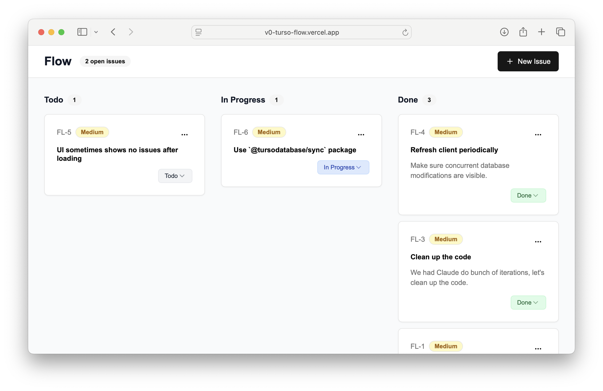

# Flow

Flow is a simple issue tracker built with <a a href="https://v0.app">v0</a> and <a href="https://turso.tech">Turso</a>. The purpose of this project is to showcase Turso in the browser.

## Overview

The front-end uses <a href="https://tanstack.com/db/">TanStack DB</a> and the <a href="https://www.npmjs.com/package/@tursodatabase/sync">Turso Sync</a> package to provide a responsive UI. TanStack DB provides the in-memory database for live queries where UI is updated instantly as data changes. Turso Sync, in contrast, provides an embedded, SQLite-compatible database, that automatically sync to the Turso Cloud.

  

## License

This project is licensed under the [MIT license].

[MIT license]: LICENSE.md
